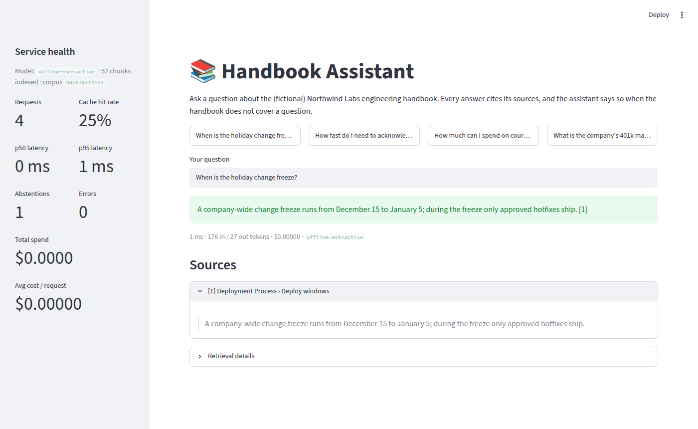
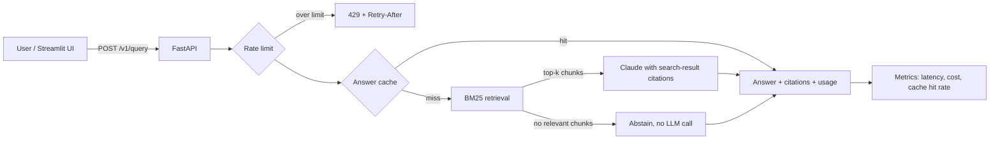

# Production RAG Service

[](https://github.com/tsriharsha402/production-rag-service/actions/workflows/ci.yml)


A question-answering API over internal documents, built the way it would need to be built
to run in production: grounded answers with verifiable citations, an evaluation suite that
gates every change in CI, caching, rate limiting and per-request cost tracking.

## Executive summary

| | |
|---|---|
| **Problem** | Employees lose time searching policy docs, and generic chatbots answer confidently from outside knowledge, sometimes wrongly. |
| **Solution** | A retrieval-augmented API that answers only from the company's documents, cites the exact supporting text, and says "I don't know" when the documents don't cover a question. |
| **Quality** | 46-question evaluation set runs in CI on every change. With Claude, 84.8% of questions pass and it never answered a question the documents can't answer (see [Evaluation](#evaluation)). |
| **Cost control** | Cost is tracked per request. Repeated questions are served from cache for $0, and questions with no relevant documents are answered without calling the model. |
| **Risk control** | Verifiable citations, explicit abstention, rate limiting per client, no secrets in code, refusal fallback, decision records for every major tradeoff. |


<sub>The Streamlit UI running in offline mode (no API key): answer with citation, source quote and live service metrics.</sub>

## Architecture



| Component | Choice | Why |
|---|---|---|
| API | FastAPI + Pydantic | Typed request/response contracts, OpenAPI docs at `/docs` |
| Retrieval | BM25 over section-aware chunks | Zero infrastructure, a strong baseline ([ADR 0001](docs/decisions/0001-start-with-bm25-retrieval.md)) |
| Generation | Claude (`claude-opus-5-5`) with `search_result` blocks | Every citation quotes a retrieved chunk verbatim ([ADR 0004](docs/decisions/0004-grounding-citations-and-model-choice.md)) |
| Offline mode | Deterministic extractive baseline | Tests and CI need no API key ([ADR 0002](docs/decisions/0002-provider-interface-with-offline-baseline.md)) |
| Cache | In-memory LRU+TTL, or Redis | Invalidated automatically when documents change ([ADR 0003](docs/decisions/0003-exact-match-answer-cache.md)) |
| Rate limiting | Token bucket per client | Protects the API budget from runaway clients |
| Observability | Structured JSON logs, request IDs, `/v1/metrics` | p50/p95 latency, spend, cache hit rate, abstentions |

## Quickstart

**1. Offline, no API key (about 1 minute)**

```bash
git clone https://github.com/tsriharsha402/production-rag-service
cd production-rag-service
python -m venv .venv && source .venv/bin/activate
make install
make run          # API on http://localhost:8000, docs at /docs
make ui           # in a second terminal: UI on http://localhost:8501
```

**2. With Claude**

```bash
cp .env.example .env      # then set ANTHROPIC_API_KEY in .env
set -a && source .env && set +a
make run
```

**3. Docker (API + UI + Redis)**

```bash
cp .env.example .env      # optional: add ANTHROPIC_API_KEY
docker compose up --build
```

## API

```bash
curl -s localhost:8000/v1/query \
  -H 'content-type: application/json' \
  -d '{"question": "When is the holiday change freeze?"}'
```

```json
{
  "answer": "A company-wide change freeze runs from December 15 to January 5; during the freeze only approved hotfixes ship. [1]",
  "abstained": false,
  "cached": false,
  "citations": [
    {
      "ref": 1,
      "chunk_id": "deployment-process#1",
      "doc_id": "deployment-process",
      "title": "Deployment Process",
      "section": "Deploy windows",
      "quote": "A company-wide change freeze runs from December 15 to January 5; during the freeze only approved hotfixes ship."
    }
  ],
  "retrieved": [
    {"ref": 1, "chunk_id": "deployment-process#1", "doc_id": "deployment-process", "title": "Deployment Process", "section": "Deploy windows", "score": 6.66}
  ],
  "usage": {"model": "offline-extractive", "input_tokens": 176, "output_tokens": 27, "cost_usd": 0.0, "latency_ms": 0.7}
}
```

<sub>Response from offline mode, abbreviated. With Claude, `answer` is a written response with `[n]` markers and `usage` reports real token counts and cost.</sub>

| Endpoint | Purpose |
|---|---|
| `POST /v1/query` | Answer a question. Returns 429 with `Retry-After` when rate limited, 503 when the model API is unavailable. |
| `GET /v1/metrics` | Requests, cache hit rate, abstentions, errors, p50/p95 latency, tokens, total and average cost |
| `GET /healthz` | Provider, model, number of indexed chunks, corpus version |

## Evaluation

[`evals/dataset.jsonl`](evals/dataset.jsonl) has 46 questions about the sample handbook:
33 direct questions, 8 deliberately paraphrased "hard" questions, and 5 questions the
documents cannot answer. Each answerable question lists the document that should be cited
and the facts the answer must contain.

| Metric | What it measures |
|---|---|
| Retrieval hit@1 / hit@k / MRR | Did retrieval surface the right document, and how high? |
| Answer keyword recall | Does the answer contain the required facts? |
| Citation accuracy | Does the answer cite the right document? |
| False abstention rate | How often it says "I don't know" when the answer is in the documents |
| Abstention accuracy | How often it correctly says "I don't know" when the answer isn't |
| Cost and latency | Total and per-question cost, p50/p95 latency |

**Offline baseline** (measured, runs in CI on every push; full report in [`evals/results/offline.md`](evals/results/offline.md)):

| Retrieval hit@1 | Retrieval hit@k | MRR | Keyword recall | Citation accuracy | Abstention accuracy |
|---|---|---|---|---|---|
| 90.2% | 95.1% | 0.917 | 61.0% | 78.0% | 80.0% |

The retrieval numbers apply to every configuration. The answer numbers are a floor from
a deliberately simple extractive baseline, not the product's quality. CI fails the build
if retrieval hit@k drops below 90%, keyword recall below 55% or abstention accuracy below
60%, so a regression in chunking or retrieval can't merge silently.

**With Claude** (`claude-opus-5-5`, effort medium; measured 2026-10-05 with `make eval-live`;
full report in [`evals/results/claude-opus-5-5.md`](evals/results/claude-opus-5-5.md)):

| Pass rate | Keyword recall | Citation accuracy | False abstention | Abstention accuracy | Cost per question | Latency p50 / p95 |
|---|---|---|---|---|---|---|
| 84.8% | 82.9% | 82.9% | 17.1% | 100.0% | $0.0093 | 3.2s / 6.3s |

The full run cost $0.43. Claude never invented an answer: it abstained on all 5 unanswerable
questions. All 7 failures are "I don't know" answers to answerable questions, and in every
one the required fact was not in the retrieved chunks. Retrieval found the right *document*
but the wrong *section* (6 cases) or nothing above the score threshold (1 case). The
doc-level hit@k of 95.1% overstates retrieval: only 82.9% of answerable questions get the
chunk that contains the answer. Retrieval, not the model, is the bottleneck.

## Cost model

Cost is computed per request from the token usage the API returns
([`pricing.py`](src/rag_service/pricing.py)) and aggregated at `/v1/metrics`.

Measured for `claude-opus-5-5` at effort medium ($4 input / $20 output per million tokens).
Token averages come from the same request in
[llm-model-selection](https://github.com/tsriharsha402/llm-model-selection) (run 2026-10-05);
the cost per question is from `make eval-live`:

| Measure | Value |
|---|---|
| Input per question (system prompt + 4 search results + question) | ~1,490 tokens → $0.0060 |
| Output per question (answer + reasoning) | ~180 tokens → $0.0036 |
| **Cost per uncached question** (measured, 46 questions) | **$0.0093** |
| 1,000 questions/day at a 30% cache hit rate | ~$6.50/day, ~$200/month |

Input tokens are about 60% of the cost, so the cheapest levers are fewer or shorter chunks
per request and prompt caching for the fixed system prompt. Lowering `LLM_EFFORT` saves less
than expected: effort low cost 5% less than medium in the model-selection run.
Whether a cheaper configuration holds quality on this task is measured in the companion
project [llm-model-selection](https://github.com/tsriharsha402/llm-model-selection).

The levers, in order: caching (free), abstaining without an LLM call (free), lowering
`LLM_EFFORT`, then a smaller model if the evaluation suite shows quality holds.

## Design decisions

- [0001: Start with BM25 lexical retrieval](docs/decisions/0001-start-with-bm25-retrieval.md)
- [0002: Provider interface with an offline baseline](docs/decisions/0002-provider-interface-with-offline-baseline.md)
- [0003: Exact-match answer cache before a semantic cache](docs/decisions/0003-exact-match-answer-cache.md)
- [0004: Grounded answers with native citations; model defaults](docs/decisions/0004-grounding-citations-and-model-choice.md)

## Limitations

- **Lexical retrieval** misses paraphrases with no shared words. It is the main source of
  retrieval failures in the evaluation set.
- **Single-turn only.** No conversation history or follow-up questions.
- **No authentication.** Rate limiting is per client ID or IP. Put it behind an API
  gateway or SSO before exposing it.
- **In-process metrics** reset on restart and are per replica. Production would export
  them to Prometheus or OpenTelemetry.
- **Small evaluation set.** 46 questions catch regressions but aren't enough to compare
  close configurations with statistical confidence.

## Roadmap

- [x] Publish Claude evaluation results (`make eval-live`) next to the baseline
- [ ] Hybrid retrieval: BM25 + embeddings in PostgreSQL/pgvector, kept only if hit@1 improves
- [ ] OpenTelemetry tracing across retrieval and generation
- [ ] Streaming responses for lower perceived latency
- [ ] Semantic cache for paraphrased questions, with a measured wrong-hit rate
- [ ] LLM-graded answer quality to complement keyword recall

## What I'd do with a team of four

| Role | First 90 days |
|---|---|
| **Retrieval engineer** | Hybrid retrieval on pgvector, grow the evaluation set to 300+ questions from real (anonymized) user queries |
| **Platform engineer** | Auth via SSO, OpenTelemetry, Prometheus dashboards and alerting, autoscaling |
| **Full-stack engineer** | Chat UI with conversation history, feedback buttons that feed the evaluation set |
| **Applied AI engineer** | LLM-graded evaluations, model and effort tuning for cost, prompt-injection testing |

My role: own the roadmap and the quality bar (no model, prompt or retrieval change ships
without evaluation results), run the AI risk review with security and legal, and report
adoption, answer quality and cost per answer to stakeholders every month.

## Project structure

```
src/rag_service/
  api.py          FastAPI app, middleware, error mapping
  pipeline.py     cache → retrieve → abstain or generate → cite
  retrieval.py    BM25 index
  documents.py    markdown loading and section-aware chunking
  llm.py          Claude provider and offline baseline
  cache.py        in-memory and Redis answer caches
  rate_limit.py   per-client token bucket
  metrics.py      latency, cost and cache metrics
  pricing.py      per-model token prices
  evaluation.py   evaluation metrics and report
evals/            dataset, runner, published results
ui/               Streamlit front end
data/handbook/    sample corpus (fictional company handbook)
docs/decisions/   architecture decision records
tests/            unit and API tests (no API key needed)
```

## License

[MIT](LICENSE)
